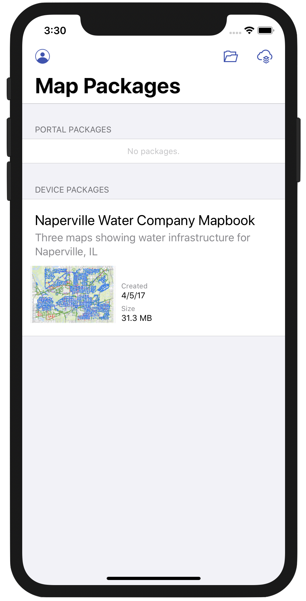
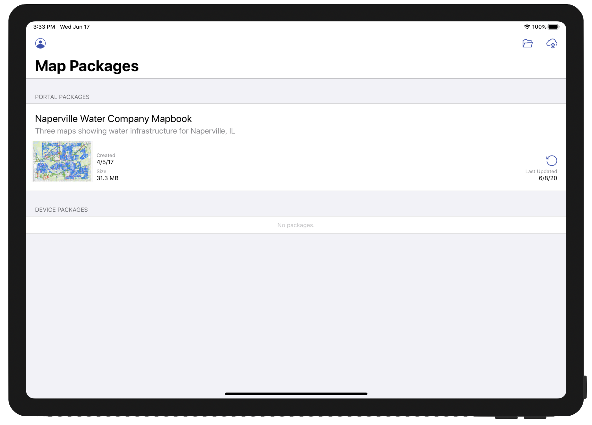

## Description

Learn how to create and share mobile map packages so that you can take your organization's maps offline and view them in the field with an iOS app. This example demonstrate how to:

- Download the mobile map package from an organization using authenticated access
- Display a table of contents (TOC) and legend
- Identify multiple features and display popup data with a Callout
- Search
- Show bookmarks
- Create and share your own mobile map package

## Design considerations

The app is designed to open mobile map packges stored on the **Device** mode or downloaded from **Portal**.

| iPhone | iPad |
| --- | --- |
|  | 


### Portal

Tapping the cloud button item located in the navigation bar allows users to browse for and download mobile map packages located in a **Portal**. Browsing a portal requires authentication.

#### Portal Authentication

A user can authenticate by tapping the profile button item located in the navigation bar. A user has the option to sign in to ArcGIS Online or they can specify a URL to an Enterprise Portal.

#### Search portal

The **Portal** mobile map packages view contains a search widget that filters results based on a search string. The app ships with a default search string _"Offline Mapbook"_ when accessing ArcGIS Online so that the app can showcase a _mobile map package_ named **Naperville Water Company Mapbook** designed specifically for this app. This _mobile map package_ highlights particular features supported by the app: table of contents, legend, search, bookmarks, and callouts.

> It's important that the default behavior of the app results in a user downloading this particular mobile map package named **Naperville Water Company Mapbook** from ArcGIS Online since this doc assumes this mobile map package is downloaded.

The developer can change this default search string by updating the value for `DefaultPortalBrowserSearchString` of `AGSConfiguration` located in the `Info.plist`. While the app is running, the user can also clear the search filter to see all mobile map package items. If an app user enters a custom portal url, then the default behavior described above is not enabled. The user should be able to see any mobile map packages in their **Portal** since the content will not be filtered.

### Device

Tapping the folder button item in the navigation bar allows the users to browse the **Device**'s local file system for mobile map packages. The app uses `UIDocumentPickerViewController` to browse and import files with the extension `.mmpk`.

_Note, when a user imports an `.mmpk` from device, a copy is produced and stored in the app's document directory._

#### Exported `.mmpk` Uniform Type Identifier

A custom [Exported Type Uniform Type Identifier](https://developer.apple.com/library/archive/documentation/FileManagement/Conceptual/understanding_utis/understand_utis_declare/understand_utis_declare.html#:~:text=An%20exported%20UTI%20declaration%20means,it%20as%20an%20exported%20UTI.&text=To%20do%20so%2C%20your%20application,it%20as%20an%20imported%20declaration.) was created to narrow the scope of the document picker to browse for and import mobile map packages only. This Exported Type UTI can be found in the `Info.plist`.

```xml
<?xml version="1.0" encoding="UTF-8"?>
<!DOCTYPE plist PUBLIC "-//Apple//DTD PLIST 1.0//EN" "http://www.apple.com/DTDs/PropertyList-1.0.dtd">
<plist version="1.0">
<array>
	<dict>
		<key>UTTypeConformsTo</key>
		<array>
			<string>public.data</string>
			<string>public.archive</string>
		</array>
		<key>UTTypeDescription</key>
		<string>Esri Mobile Map Package</string>
		<key>UTTypeIdentifier</key>
		<string>public.mmpk</string>
		<key>UTTypeTagSpecification</key>
		<dict>
			<key>public.filename-extension</key>
			<array>
				<string>mmpk</string>
			</array>
		</dict>
	</dict>
</array>
</plist>
```

## App developer patterns

Now that the mobile map package has been created and published, it can be downloaded by the app using an authenticated connection.

### Authentication

Offline Mapbook leverages the ArcGIS [authentication](https://developers.arcgis.com/documentation/core-concepts/security-and-authentication/) model to provide access to resources via the the [named user](https://developers.arcgis.com/documentation/core-concepts/security-and-authentication/mobile-and-native-user-logins/) login pattern. When accessing **Portal**, the app prompts the user for their credentials used to obtain a token. The ArcGIS Runtime SDKs provide a simple to use API for dealing with ArcGIS logins.

The process of accessing token secured services with a challenge handler is illustrated in the following diagram.


1. A request is made to a secured resource.
2. The portal responds with an unauthorized access error.
3. A challenge handler associated with the identity manager is asked to provide a credential for the portal.
4. A UI displays and the user is prompted to enter a user name and password.
5. If the user is successfully authenticated, a credential (token) is included in requests to the secured service.
6. The identity manager stores the credential for this portal and all requests for secured content includes the token in the request.

The `AGSOAuthConfiguration` class takes care of steps 1-6 in the diagram above. For an application to use this pattern, follow these [guides](https://developers.arcgis.com/documentation/core-concepts/security-and-authentication/signing-in-arcgis-online-users/) to register your app.

``` Swift
let oauthConfig = AGSOAuthConfiguration(portalURL: portal.url, clientID: clientId, redirectURL: oAuthRedirectURL)
AGSAuthenticationManager.shared().oAuthConfigurations.add(oauthConfig)
```

Any time a secured service issues an authentication challenge, the `AGSOAuthConfiguration` and the app's `UIApplicationDelegate` work together to broker the authentication transaction. The `oAuthRedirectURL` above tells iOS how to call back to Offline Mapbook to confirm authentication with the Runtime SDK.

iOS knows to call the `UIApplicationDelegate` with this URL, and we pass that directly to an ArcGIS Runtime SDK helper function to retrieve a token:

``` Swift
// UIApplicationDelegate function called when "mapbook://auth" is opened.
func application(_ app: UIApplication, open url: URL, options: [UIApplicationOpenURLOptionsKey : Any] = [:]) -> Bool {
    // Pass the OAuth callback through to the ArcGIS Runtime helper function
    AGSApplicationDelegate.shared().application(app, open: url, options: options)

    // Let iOS know we handled the URL OK
    return true
}
```

To tell iOS to call back like this, Offline Mapbook configures a `URL Type` in the `Info.plist` file.


Note the value for URL Schemes. Combined with the text `auth` to make `mapbook://auth`, this is the [redirect URI](https://developers.arcgis.com/documentation/core-concepts/security-and-authentication/browser-based-user-logins/#configuring-a-redirect-uri) that you configured when you registered your app [here](https://developers.arcgis.com/dashboard/). For more details on the user authorization flow, see the [Authorize REST API](https://developers.arcgis.com/rest/users-groups-and-items/authorize.htm).

For more details on configuring the Offline Mapbook for OAuth, see [the main README.md](https://github.com/Esri/mapbook-ios#2-configuring-the-project)

### Identify

Identify lets you recognize features on the map view. To know when the user interacts with the map view you need to adopt the `AGSGeoViewTouchDelegate` protocol. The methods on the protocol inform about single tap, long tap, force tap etc. To identify features, the tapped location is used with the identify method on map view.

```swift
extension MapViewController: AGSGeoViewTouchDelegate {

    func geoView(_ geoView: AGSGeoView, didTapAtScreenPoint screenPoint: CGPoint, mapPoint: AGSPoint) {
        // Handle tap event...
    }
}
```

The API provides the ability to identify multiple layer types, with results being stored in `subLayerContent`. Developers should note that if they choose to identify other layer types, like `AGSArcGISMapImageLayer` for example, they would need to add that implementation themselves.

### Displaying identify results

Results of the identify action are displayed using [`PopUp`](https://developers.arcgis.com/ios/latest/swift/guide/essential-vocabulary.htm#GUID-3FD39DD2-FFEF-4010-9B90-09BF1E230E8F). The geoelements identified are used to initialize popups. And these popups are shown using `AGSPopupsViewController`.

```swift
// gather pop-ups

var popups:[AGSPopup] = []

for result in results {
    for geoElement in result.geoElements {
        let popup = AGSPopup(geoElement: geoElement)
        popup.popupDefinition.title = result.layerContent.name
        popups.append(popup)
    }
}

// show using pop-ups view controller

guard !popups.isEmpty else { return }

let popups = AGSPopupsViewController(popups: popups, containerStyle: .navigationBar)
popups.delegate = self
popups.modalPresentationStyle = .popover
popups.popoverPresentationController?.permittedArrowDirections = [.up, .down]
popups.popoverPresentationController?.sourceRect = CGRect(origin: screenPoint, size: CGSize.zero)
popups.popoverPresentationController?.sourceView = mapView
popups.popoverPresentationController?.delegate = self

self.present(popups, animated: true, completion: nil)
```


### TOC & legend

Layer visibility can be toggled in the table of contents (TOC). In addition to the layer name, a list of legends is also shown for each layer. Legends for each operational layer or its sublayer or sub-sublayer or so on are fetched and populated into a table view controller. The table view has two kinds of cell. One for the layer, to display layer name and provide ability to toggle on/off. The other for the legends for that layer, displaying its swatch and name.

```swift
/*
 Populate legend infos recursively, for sublayers.
*/
private func populateLegends(with layers:[AGSLayer]) {

    for layer in layers {

        if layer.subLayerContents.count > 0 {
            self.populateLegends(with: layer.subLayerContents as! [AGSLayer])
        }
        else {
            //else if no sublayers fetch legend info
            self.content.append(layer)
            layer.fetchLegendInfos { [weak self, constLayer = layer] (legendInfos, error) -> Void in

                guard error == nil else {
                    //show error
                    return
                }

                if let legendInfos = legendInfos, let index = self?.content.index(of: constLayer) {
                    self?.content.insert(contentsOf: legendInfos as [AGSObject], at: index + 1)
                    self?.tableView.reloadData()
                }
            }
        }
    }
}
```


### Bookmarks

A `Bookmark` identifies a particular geographic location and time on an ArcGIS Map. In Offline Mapbook, the list of bookmarks saved in the map are shown in the table view. You can select one to update the map view's viewpoint with the bookmarked viewpoint.

The app uses the `BookmarksViewController` that ships with the ArcGIS Toolkit for iOS.

```swift
private func showBookmarks() {
    // Bookmarks View Controller
    let bookmarks = BookmarksViewController(geoView: mapView)
    bookmarks.delegate = self
    bookmarks.navigationItem.leftBarButtonItem = UIBarButtonItem(
        barButtonSystemItem: .done,
        target: self,
        action: #selector(done)
    )
    // Embed Bookmarks View Controller into a Navigation Controller
    let navigation = UINavigationController(rootViewController: bookmarks)
    navigation.modalPresentationStyle = .popover
    navigation.popoverPresentationController?.barButtonItem = ellipsisButton
    navigation.popoverPresentationController?.permittedArrowDirections = .up
    // Present Bookmarks
    present(navigation, animated: true, completion: nil)
}
```

The map view controller responds to users interacting with the bookmarks view controller through its delegate.

```swift
func bookmarksViewController(_ bookmarksViewController: BookmarksViewController, didSelect bookmark: AGSBookmark) {

    // dismiss if the device is an iPhone, otherwise the view will dismiss when the user taps done or taps out of the popover.
    defer {
        if UIDevice.current.userInterfaceIdiom == .phone {
            bookmarksViewController.dismiss(animated: true, completion: nil)
        }
    }

    guard let viewpoint = bookmark.viewpoint else { return }

    // set the map's view point to the geometry of the bookmark.
    self.mapView.setViewpoint(viewpoint, completion: nil)
}
```


### Suggestions & search

Typing the first few letters of an address into the search bar (e.g. "123") shows a number of suggestions. This is using a simple call on the `AGSLocatorTask`.

```swift
let params: AGSSuggestParameters = {
    let suggestParameters = AGSSuggestParameters()
    suggestParameters.maxResults = AppSettings.locatorSearchSuggestionSize ?? 12
    return suggestParameters
}()

self.suggestCancelable = locatorTask.suggest(
    withSearchText: text,
    parameters: params
) { [weak self] (suggestResults, error) in
    guard let self = self else { return }

    guard error == nil else {
        if let error = error as NSError?, error.code != NSUserCancelledError {
            flash(error: error)
        }
        return
    }

    if let results = suggestResults {
        self.suggestResults = results
    }
    else {
        self.suggestResults = [AGSSuggestResult]()
    }

    self.tableView.reloadData()
}
```

Once a suggestion in the list has been selected by the user, the suggested address is geocoded using the geocode method of the `AGSLocatorTask`.

```swift
fileprivate func geocode(for suggestResult:AGSSuggestResult) {

    guard let locatorTask = locatorTask, locatorTask.loadStatus == .loaded else {
        preconditionFailure("LocatorTask must be loaded.")
    }

    geocodeCancelable?.cancel()
    geocodeCancelable = locatorTask.geocode(with: suggestResult) { [weak self] (geocodeResults, error) in
        guard let self = self else { return }

        guard error == nil else {
            if let error = error as NSError?, error.code != NSUserCancelledError {
                flash(error: error)
            }
            return
        }

        if let result = geocodeResults?.first {
            self.delegate?.locatorSuggestionController(self, didFind: result)
        }
        else {
            self.delegate?.locatorSuggestionControllerFoundNoResults(self)
        }
    }
}
```


### Check for mobile map package updates

When a user taps the mobile map package's table cell refresh button, if a newer version of the mobile map package is available, the app will update the mobile map package.

```swift
func checkForUpdates(packages: [PortalAwareMobileMapPackage], completion: @escaping () -> Void) throws {

    guard let portal = portal else { throw UnknownError() }

    let coupled = packages.compactMap { (package) -> MMPKCoupled? in
        guard let itemID = package.itemID else {
            package.canUpdate = false
            return nil
        }
        let item = AGSPortalItem(portal: portal, itemID: itemID)
        return MMPKCoupled(package: package, item: item)
    }

    guard coupled.count > 0 else { completion(); return }

    AGSLoadObjects(coupled.map({ $0.item })) { (_) in
        for couple in coupled {
            if let downloaded = couple.package.downloadDate, let modified = couple.item.modified {
                couple.package.canUpdate = modified > downloaded
            }
            else {
                couple.package.canUpdate = false
            }
        }
        completion()
    }
}
```

## Create your own mobile map packages

Offline Mapbook for iOS is designed to work exclusively with [mobile map packages](http://pro.arcgis.com/en/pro-app/help/sharing/overview/mobile-map-package.htm) or .mmpks. With this app, you can open any mobile map package by either side-loading it or hosting it on a portal or ArcGIS Online organization.

This example app, however, has been tailored to leverage specific features of the SDK that depend on specific information being saved with a mobile map package. This was done with consideration of the following:

- `.mmpks` with locator(s)
- `.mmpks` with bookmark(s)
- `.mmpks` with multiple maps
- `.mmpks` whose maps have useful metadata

Although `.mmpks` not containing this information may be still be opened and viewed, features built into the app to leverage this info may not appear relevant. For example, attempting to use the search bar may not locate any features, or the bookmarks sidebar may appear blank.

With this in mind, read on below to learn how to create and share a mobile map package with your own data and take advantage of the full suite of capabilities offered in this example app.

### Data scenario

In this example, an employee of the fictitious 'Naperville Water Company' requires offline access to the following types of data while out in the field:

- An 811 map displaying locations of water mains and lines that should be marked when citizens call '811'
- An emergency response map displaying locations of water valves and their associated mains that might need to be turned off in the case of an emergency leak
- A capital improvement project (CIP) map displaying locations of newly-proposed water mains and water lines that need to either be further assessed or established

The table below summarizes the layers within each map that are visible by default:

| Layer                   | 811 Map | Emergency Response Map | CIP Map |
|:------------------------|:-------:|:----------------------:|:-------:|
| **Water Lateral Lines** | X       |                        | X       |
| **Water Mains**         | X       | X                      | X       |
| **Water System Valves** |         | X                      |         |
| **Reference Backdrop**  | X       | X                      | X       |

### Authoring the data for viewing

#### Setting symbology

It is important that each map be made to look unique and effectively convey its purpose. In order to achieve this, field attributes were chosen that were most relevant to the map's intended goal and then symbolized using a unique value renderer. In many cases, this yielded multiple classes being represented per layer. The following table identifies the attribute chosen for each layer on a per-map basis.

| Layer                   | 811 Map       | Emergency Response Map | CIP Map         |
|:------------------------|:-------------:|:----------------------:|:---------------:|
| **Water Lateral Lines** | pipe material |                        | proposal status |
| **Water Mains**         | pipe material | pipe diameter          | proposal status |
| **Water System Valves** |               | valve type             |                 |

#### Creating a reference backdrop

To keep the mobile map package (.mmpk) as small as possible, the reference layer was packaged into a .vtpk or [vector tile package](http://pro.arcgis.com/en/pro-app/help/sharing/overview/vector-tile-package.htm) and used as basemap within each map. For more information about how to create a vector tile package, see the help topic for the [Create Vector Tile Package](http://pro.arcgis.com/en/pro-app/tool-reference/data-management/create-vector-tile-package.htm) geoprocessing tool.

#### Creating locators

Offline Mapbook supports geocoding and search so a [locator](http://desktop.arcgis.com/en/arcmap/10.3/guide-books/geocoding/essential-geocoding-vocabulary.htm) was built for each layer in the app by using the [Create Address Locator](http://pro.arcgis.com/en/pro-app/tool-reference/geocoding/create-address-locator.htm) geoprocessing tool once per layer. Most crucial to this part of the workflow was that 'General - Single Field' was chosen for the "Address Locator Style". This style is useful for allowing searching of the contents within a single field, which was sufficient for the purpose of app.

The following layers in the app are searchable:

- Water Lateral Lines
- Water Mains
- Water System Valves
- Address Points

Once an address locator, or .loc file, is created for each layer, it was time to run the [Create Composite Address Locator](http://pro.arcgis.com/en/pro-app/tool-reference/geocoding/create-composite-address-locator.htm) geoprocessing tool. The Create Composite Locator tool allows multiple, individual .loc files to be specified as an input so that it can package the contents into a single resulting _composite_ .loc file. Worth noting is that a composite address locator does not store the address indexing information as would a standalone .loc file, but rather references the data from the input locators that are specified when it's generated. This composite locator (.loc) file was later specified when building the mobile map package.

#### Setting bookmarks

Offline Mapbook supports viewing of predefined, bookmarked locations. Two [bookmarks](http://pro.arcgis.com/en/pro-app/help/mapping/navigation/bookmarks.htm) were set in ArcGIS Pro for each map and are included in the mobile map package.

#### Metadata and thumbnails

Before finalizing the maps for publishing, metadata was created for each map. The Title and Summary properties for each map are accessed in ArcGIS Pro by opening the Map Properties window, double clicking the map title from the Contents pane, and clicking the Metadata tab within. Like the map title and summary, a map thumbnail can also provide context. The thumbnail image for a map can be generated in ArcGIS Pro by right clicking a map's title in the Contents pane and selecting 'Create Thumbnail' from the context menu that appears. The created thumbnail can be viewed by hovering the mouse cursor over the map from the Project pane under the 'Maps' section.

### Packaging for consumption

In order for this data to be consumed within Offline Mapbook, it had to first be published as an .mmpk or ([mobile map package](http://pro.arcgis.com/en/pro-app/help/sharing/overview/mobile-map-package.htm)). An .mmpk file can either be hosted on a portal and downloaded automatically prior to running the app or, in this case, side-loaded onto the device and placed beside the app prior to running it. This subsection describes using the [Create Mobile Map Package](http://pro.arcgis.com/en/pro-app/tool-reference/data-management/create-mobile-map-package.htm) geoprocessing tool specifically for the purpose of packaging the data that was created for Offline Mapbook.

#### Including multiple maps

Because multiple maps were authored to be used for Offline Mapbook, multiple maps had to be specified when running the Create Mobile Map Package tool. The first parameter of the tool is 'Input Map' and can accommodate for the specification of multiple entries. By default, each dropdown will present a list of maps that exist within the current ArcGIS Pro project. For this mobile-map-packaging, each of the three maps was specified once.


#### Including the locator

Although a mobile map package supports multiple input locators, we simplified this process by creating a single, composite locator which references the four source locators being used. Given that this is the case, only the composite locator needed to be specified within the tool. Alternatively, the extra step of creating the composite locator and instead specifying the individual locators as inputs to the tool will work as well.

### Sharing the mobile map package

Once the .mmpk file has been created, ArcGIS provides two possible mechanisms for making a mobile map package available within a **Portal** for ArcGIS or on ArcGIS Online.

#### Using the ArcGIS Pro 'Share Package' tool

The first method for getting a locally-saved mobile map package to a **Portal** for ArcGIS or on ArcGIS Online is to 'push' it using a dedicated geoprocessing tool. This tool, called the [Share Package](http://pro.arcgis.com/en/pro-app/tool-reference/data-management/share-package.htm) tool takes an input .mmpk file (as well as a host of other types of package files created using ArcGIS) and uploads it to the desired destination. In lieu of the tool requesting credentials, these are instead retrieved from ArcGIS Pro itself. Since the credentials passed in to the current session of Pro dictate the destination **Portal** to which the package will be shared, it's helpful to be aware of with which credentials you're signed in before running the tool!

#### Uploading directly from the 'My Content' page

The second method for getting a locally-saved mobile map package to a **Portal** for ArcGIS or on ArcGIS Online is to 'pull' it using the [Add Item](http://doc.arcgis.com/en/arcgis-online/share-maps/add-items.htm) tool. This can be found from the 'My Content' page and is as simple as browsing for the local file, providing a title and some tags, and clicking 'ADD ITEM'.
